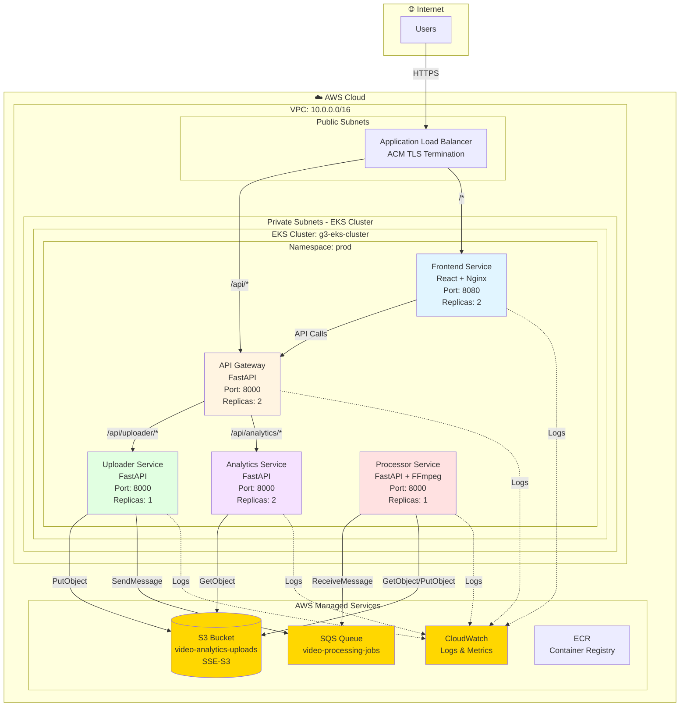
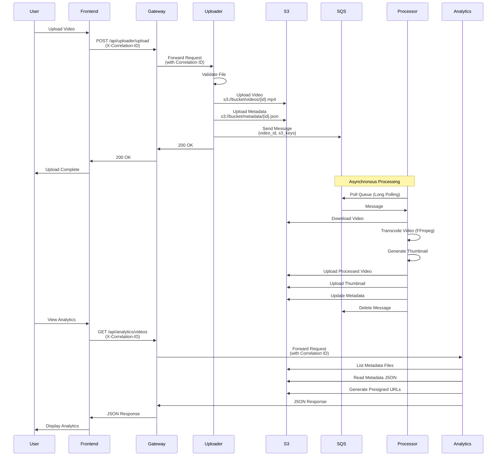
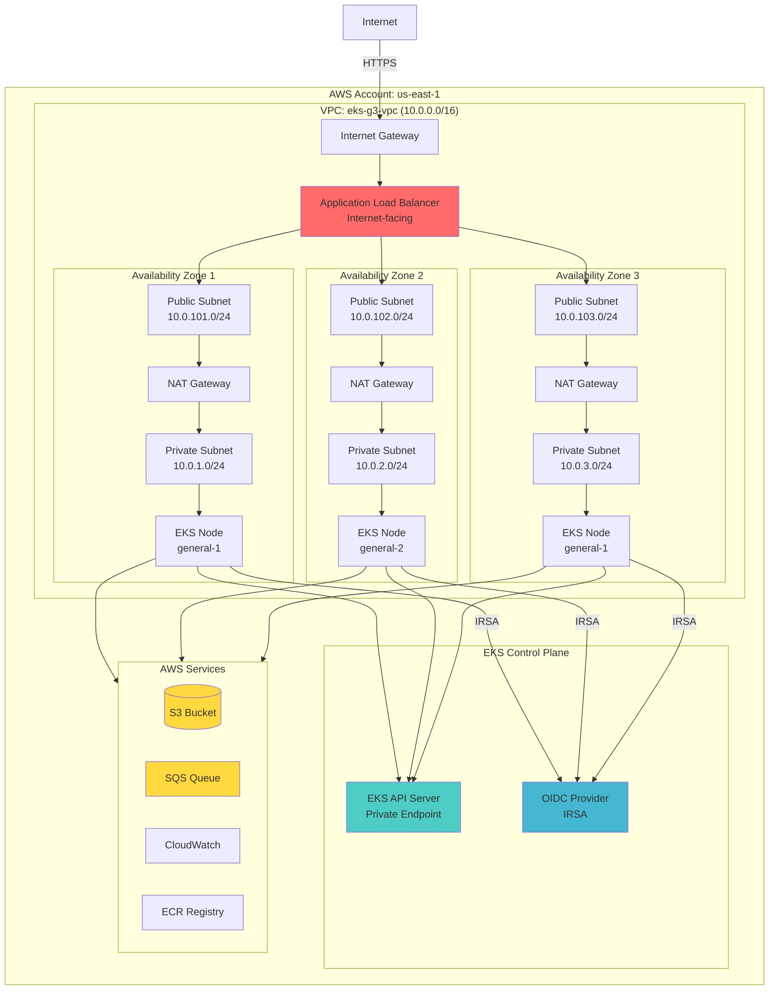
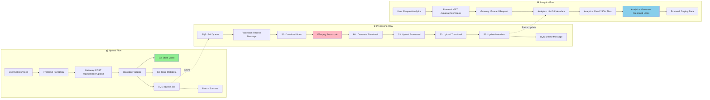
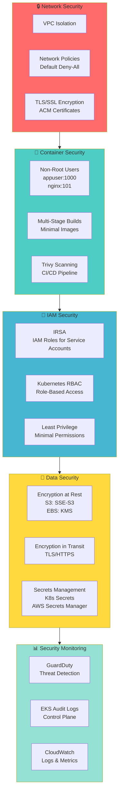
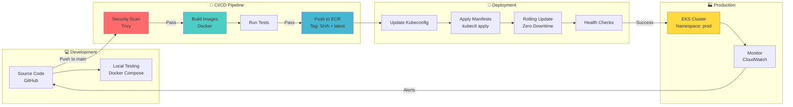

# System Architecture: Video Analytics Platform

## Table of Contents
1. [High-Level Architecture](#high-level-architecture)
2. [Component Architecture](#component-architecture)
3. [Data Flow Architecture](#data-flow-architecture)
4. [Infrastructure Architecture](#infrastructure-architecture)
5. [Network Architecture](#network-architecture)
6. [Security Architecture](#security-architecture)
7. [Deployment Architecture](#deployment-architecture)
8. [Technology Stack](#technology-stack)

---

## High-Level Architecture

### Architecture Pattern
**Microservices Architecture** with **API Gateway Pattern** and **Event-Driven Processing**

### System Architecture Diagram



### Component Interaction Diagram



### Infrastructure Architecture Diagram



### Data Flow Architecture Diagram



### Security Architecture Diagram



### Deployment Pipeline Diagram



---

## Component Architecture

### 1. Frontend Service
**Technology**: React 18 + Tailwind CSS + Nginx

**Responsibilities**:
- User interface for video uploads
- Real-time analytics dashboards
- Video viewing interface
- Progress tracking

**Deployment**:
- Container: `nginxinc/nginx-unprivileged:1.27-alpine`
- Port: 8080 (non-root user)
- Replicas: 2 (production)
- Service Type: ClusterIP

**Key Features**:
- Single Page Application (SPA)
- Client-side routing
- API integration via Gateway
- Responsive design

---

### 2. API Gateway Service
**Technology**: FastAPI + httpx

**Responsibilities**:
- Request routing to backend services
- Correlation ID generation and propagation
- Request aggregation
- Error handling and retries
- Metrics collection

**Endpoints**:
- `/api/uploader/upload` → Uploader Service
- `/api/analytics/*` → Analytics Service
- `/health` → Health check

**Deployment**:
- Replicas: 2 (production)
- Port: 8000
- Service Type: ClusterIP

**Key Features**:
- Async HTTP client (httpx)
- Request timeout: 15 seconds
- Correlation ID header propagation
- Prometheus metrics endpoint

---

### 3. Uploader Service
**Technology**: FastAPI + boto3

**Responsibilities**:
- Video file upload validation
- Streaming upload to S3
- Metadata creation and storage
- SQS message queuing for processing

**Endpoints**:
- `POST /upload` - Upload video file
- `GET /health` - Health check

**AWS Integration**:
- S3: Video file storage (`video-analytics-uploads` bucket)
- SQS: Job queue (`video-processing-jobs`)

**Deployment**:
- Replicas: 1 (production)
- Port: 8000
- Service Account: `uploader-sa` (IRSA enabled)

**Key Features**:
- File size limit: 500MB
- Supported formats: mp4, mov, avi, webm, mkv, flv, wmv, m4v
- Streaming upload (no memory buffering)
- Metadata stored as JSON in S3

---

### 4. Processor Service
**Technology**: FastAPI + boto3 + FFmpeg

**Responsibilities**:
- SQS message consumption
- Video transcoding (FFmpeg)
- Thumbnail generation
- Metadata updates

**Processing Flow**:
1. Polls SQS queue (long polling: 20s)
2. Downloads video from S3
3. Transcodes video (if needed)
4. Generates thumbnail
5. Uploads processed video and thumbnail to S3
6. Updates metadata in S3
7. Deletes SQS message

**Deployment**:
- Replicas: 1 (production, scalable)
- Port: 8000
- Service Account: `processor-sa` (IRSA enabled)

**Key Features**:
- Asynchronous processing
- Parallel message processing
- FFmpeg for video operations
- PIL for thumbnail generation
- Error handling with retries

---

### 5. Analytics Service
**Technology**: FastAPI + boto3

**Responsibilities**:
- Video metadata retrieval
- Statistics aggregation
- Presigned URL generation
- View/like tracking (stored in S3 metadata)

**Endpoints**:
- `GET /videos` - List all videos
- `GET /video/{video_id}` - Get video details
- `GET /stats` - Get analytics statistics
- `POST /view/{video_id}` - Record view
- `POST /like/{video_id}` - Record like

**AWS Integration**:
- S3: Metadata and video retrieval, view/like tracking

**Deployment**:
- Replicas: 2 (production)
- Port: 8000
- Service Account: `analytics-sa` (IRSA enabled)

**Key Features**:
- Presigned URLs for secure S3 access
- Thumbnail fallback generation
- Engagement metrics calculation
- Sorting and filtering
- View/like counts stored in S3 metadata JSON files

---

## Data Flow Architecture

### Video Upload Flow

```
1. User → Frontend
   └─> Selects video file

2. Frontend → Gateway (POST /api/uploader/upload)
   └─> Includes X-Correlation-ID header
   └─> Multipart form data

3. Gateway → Uploader Service
   └─> Forwards request with correlation ID
   └─> Streams file data

4. Uploader Service:
   ├─> Validates file type and size
   ├─> Generates unique video_id (UUID)
   ├─> Uploads video to S3: s3://bucket/videos/{video_id}.{ext}
   ├─> Creates metadata JSON
   ├─> Uploads metadata to S3: s3://bucket/metadata/{video_id}.json
   └─> Sends message to SQS queue

5. SQS Queue:
   └─> Message: {
         "video_id": "...",
         "s3_bucket": "...",
         "s3_video_key": "...",
         "s3_metadata_key": "..."
       }

6. Processor Service:
   ├─> Polls SQS (long polling)
   ├─> Receives message
   ├─> Downloads video from S3
   ├─> Transcodes video (if needed)
   ├─> Generates thumbnail
   ├─> Uploads processed video to S3
   ├─> Uploads thumbnail to S3
   ├─> Updates metadata in S3
   └─> Deletes SQS message

7. Frontend:
   └─> Polls Analytics API for processing status
```

### Analytics Query Flow

```
1. User → Frontend
   └─> Requests video list or analytics

2. Frontend → Gateway (GET /api/analytics/videos)
   └─> Includes X-Correlation-ID

3. Gateway → Analytics Service
   └─> Forwards request with correlation ID

4. Analytics Service:
   ├─> Lists S3 objects in metadata/ prefix
   ├─> Reads metadata JSON files
   ├─> Generates presigned URLs for videos
   ├─> Generates presigned URLs for thumbnails
   └─> Returns aggregated data

5. Gateway → Frontend
   └─> Returns JSON response

6. Frontend:
   └─> Renders data in charts/tables
```

---

## Infrastructure Architecture

### AWS VPC Structure

```
VPC: 10.0.0.0/16 (eks-g3-vpc)
│
├─ Public Subnets (Internet Gateway)
│  ├─ 10.0.101.0/24 (AZ-1)
│  ├─ 10.0.102.0/24 (AZ-2)
│  └─ 10.0.103.0/24 (AZ-3)
│     └─ NAT Gateways (one per AZ)
│
└─ Private Subnets (NAT Gateway)
   ├─ 10.0.1.0/24 (AZ-1)
   ├─ 10.0.2.0/24 (AZ-2)
   └─ 10.0.3.0/24 (AZ-3)
      └─ EKS Cluster Nodes
```

### EKS Cluster Configuration

**Cluster**: `g3-eks-cluster`
- Kubernetes Version: 1.33
- Endpoint: Private access only
- OIDC Provider: Enabled (for IRSA)

**Node Groups**:
- **general-1**: 4 nodes (desired), 3-5 (min-max)
- **general-2**: 4 nodes (desired), 3-5 (min-max)
- Instance Types: t3.medium, t3.large, t3a.medium
- AMI: AL2023_x86_64_STANDARD
- Auto-scaling: Cluster Autoscaler enabled

**Addons**:
- CoreDNS (service discovery)
- kube-proxy (networking)
- vpc-cni (AWS VPC CNI)
- eks-pod-identity-agent (IRSA support)

### Namespaces

- **prod**: Production workloads
- **staging**: Staging environment
- **dev**: Development environment
- **kube-system**: System components

---

## Network Architecture

### Ingress Configuration

**ALB Ingress Controller**:
- Scheme: Internet-facing
- Target Type: IP (direct pod targeting)
- SSL/TLS: ACM certificate (configured)

**Routing Rules**:
- `/api/*` → Gateway Service (port 8000)
- `/*` → Frontend Service (port 80)

### Network Policies

**Default Policy**: Deny all traffic (default-deny-all)

**Allowed Traffic**:
1. **Frontend → Gateway**: Port 8000
2. **Gateway → Uploader**: Port 8000
3. **Gateway → Analytics**: Port 8000
4. **All Pods → DNS**: Port 53 (UDP) to kube-system

**Egress**:
- DNS resolution (CoreDNS)
- AWS API endpoints (S3, SQS, CloudWatch)
- Internet (for base images, npm packages)

### Service Discovery

- **Kubernetes DNS**: CoreDNS
- **Service Names**: `{service-name}.{namespace}.svc.cluster.local`
- **Internal Communication**: ClusterIP services

---

## Security Architecture

### Network Security

1. **VPC Isolation**:
   - Private subnets for workloads
   - Public subnets only for ALB and NAT
   - No direct internet access to pods

2. **Network Policies**:
   - Default deny-all policy
   - Explicit allow rules for required communication
   - Least privilege network access

3. **TLS/SSL**:
   - ACM certificates for ALB
   - HTTPS termination at ALB
   - Encrypted in-transit

### Container Security

1. **Non-Root Execution**:
   - Backend services: `appuser` (UID 1000)
   - Frontend: `nginx-unprivileged` (UID 101)
   - No privileged containers

2. **Image Security**:
   - Multi-stage builds (minimal base images)
   - Trivy scanning in CI/CD
   - No secrets in images

3. **Resource Limits**:
   - CPU and memory limits defined
   - Prevents resource exhaustion

### IAM Security

1. **IRSA (IAM Roles for Service Accounts)**:
   - Uploader: S3 PutObject, SQS SendMessage
   - Processor: S3 GetObject/PutObject, SQS ReceiveMessage/DeleteMessage
   - Analytics: S3 GetObject/PutObject (for metadata updates)
   - Least privilege access

2. **RBAC**:
   - Service accounts per namespace
   - Read-only roles for CI/CD
   - Admin access restricted

### Data Security

1. **Encryption at Rest**:
   - S3: SSE-S3 (AES-256)
   - EBS: Encrypted volumes

2. **Encryption in Transit**:
   - TLS/SSL for all external traffic
   - HTTPS for API calls

3. **Secrets Management**:
   - Kubernetes Secrets for configuration
   - AWS credentials via IRSA (not stored)
   - No secrets in code or images

---

## Deployment Architecture

### CI/CD Pipeline

**GitHub Actions Workflow**:

```
1. Security Scan (Trivy)
   └─> Scans codebase for vulnerabilities
   └─> Fails on CRITICAL/HIGH

2. Build and Push (Matrix Strategy)
   └─> Services: uploader, processor, analytics, frontend
   └─> Builds Docker images
   └─> Tags with commit SHA and 'latest'
   └─> Pushes to ECR

3. Deploy to EKS
   └─> Updates kubeconfig
   └─> Applies Kubernetes manifests
   └─> Rolling updates
```

### Deployment Strategy

**Rolling Updates**:
- Zero-downtime deployments
- Health checks before traffic routing
- Automatic rollback on failure

**Replica Strategy**:
- Frontend: 2 replicas (high availability)
- Gateway: 2 replicas (load distribution)
- Analytics: 2 replicas (read scalability)
- Uploader: 1 replica (stateless, can scale)
- Processor: 1 replica (scalable based on queue depth)

### Configuration Management

**ConfigMaps**:
- AWS region, S3 bucket, SQS queue URL
- Service URLs for inter-service communication

**Secrets**:
- AWS credentials (via IRSA, not stored)

**Environment Variables**:
- Injected via ConfigMaps and Secrets
- No hardcoded values

---

## Technology Stack

### Frontend
- **Framework**: React 18.2.0
- **Styling**: Tailwind CSS 3.4.0
- **Charts**: Recharts 2.10.3
- **HTTP Client**: Axios 1.6.0
- **Routing**: React Router DOM 6.21.1
- **Icons**: Heroicons, Lucide React
- **Animation**: Framer Motion 10.16.16
- **Web Server**: Nginx (unprivileged)

### Backend
- **Framework**: FastAPI
- **Language**: Python 3.11
- **ASGI Server**: Uvicorn
- **HTTP Client**: httpx (async)
- **AWS SDK**: boto3
- **Video Processing**: FFmpeg
- **Image Processing**: PIL (Pillow)
- **Metrics**: prometheus-client

### Infrastructure
- **Container Orchestration**: Kubernetes (EKS 1.33)
- **Container Runtime**: Docker
- **Service Mesh**: Native Kubernetes services
- **Load Balancer**: AWS ALB
- **Ingress Controller**: AWS Load Balancer Controller
- **Auto-scaling**: Cluster Autoscaler

### AWS Services
- **Compute**: EKS, EC2
- **Storage**: S3 (SSE-S3)
- **Messaging**: SQS
- **Container Registry**: ECR
- **Networking**: VPC, NAT Gateway, Internet Gateway
- **IAM**: IRSA, OIDC
- **Monitoring**: CloudWatch (Logs, Metrics, Alarms)
- **Security**: GuardDuty, ACM

### DevOps Tools
- **IaC**: Terraform
- **CI/CD**: GitHub Actions
- **Container Scanning**: Trivy
- **Helm**: AWS Load Balancer Controller, Cluster Autoscaler

### Observability
- **Metrics**: Prometheus-compatible endpoints
- **Logging**: Structured JSON logs → CloudWatch
- **Tracing**: Correlation IDs
- **Dashboards**: CloudWatch Dashboards

---

## Scalability Considerations

### Horizontal Scaling
- **Stateless Services**: All services are stateless and can scale horizontally
- **Auto-scaling**: Cluster Autoscaler adjusts node count
- **Pod Scaling**: HPA-ready (can be configured)

### Vertical Scaling
- **Instance Types**: Multiple instance types for flexibility
- **Resource Limits**: CPU/memory limits per pod

### Queue-Based Processing
- **SQS**: Decouples upload from processing
- **Long Polling**: Reduces API calls
- **Visibility Timeout**: Prevents duplicate processing
- **Dead Letter Queue**: Can be configured for failed messages

### Caching Opportunities
- **Frontend**: Static assets cached
- **Analytics**: Metadata can be cached (Redis/Memcached)
- **Presigned URLs**: Time-limited access

---

## High Availability

### Multi-AZ Deployment
- **VPC**: 3 Availability Zones
- **Subnets**: Distributed across AZs
- **EKS Nodes**: Spread across AZs
- **NAT Gateways**: One per AZ

### Service Redundancy
- **Frontend**: 2 replicas
- **Gateway**: 2 replicas
- **Analytics**: 2 replicas
- **Load Balancing**: ALB distributes traffic

### Data Durability
- **S3**: 99.999999999% (11 9's) durability
- **Backups**: S3 versioning (can be enabled)

---

## Disaster Recovery

### Backup Strategy
- **S3**: Versioning and lifecycle policies
- **Infrastructure**: Terraform state in S3

### Recovery Procedures
- **Infrastructure**: Terraform apply
- **Applications**: Kubernetes manifests
- **Data**: S3 backups

---

## Performance Characteristics

### Latency
- **API Gateway**: < 50ms (internal routing)
- **S3 Upload**: Depends on file size and network
- **Video Processing**: Depends on video length and resolution
- **Analytics Queries**: < 500ms (S3 list + read operations)

### Throughput
- **Upload**: Limited by S3 and network bandwidth
- **Processing**: Limited by CPU and FFmpeg performance
- **Analytics**: Limited by S3 API rate limits

### Optimization
- **Streaming Uploads**: No memory buffering
- **Async Processing**: Non-blocking operations
- **Presigned URLs**: Direct S3 access (reduces gateway load)
- **Connection Pooling**: httpx async client

---

## Monitoring and Alerting

### Metrics Collected
- **Application**: Request count, latency, error rate
- **Infrastructure**: CPU, memory, network
- **AWS**: S3 operations, SQS queue depth

### Alarms
- **High Error Rate**: > 5% 5xx errors for 5 minutes
- **High Latency**: P95 latency > 2s for 5 minutes
- **Queue Backlog**: SQS visible messages > 1000
- **CPU/Memory**: Cluster resource utilization

### Dashboards
- **Application Overview**: Traffic, success rates, health
- **Worker Performance**: Queue depth vs processing time
- **Infrastructure**: Cluster metrics, ALB metrics

---

This architecture provides a scalable, secure, and maintainable microservices platform for video analytics with clear separation of concerns and cloud-native best practices.
